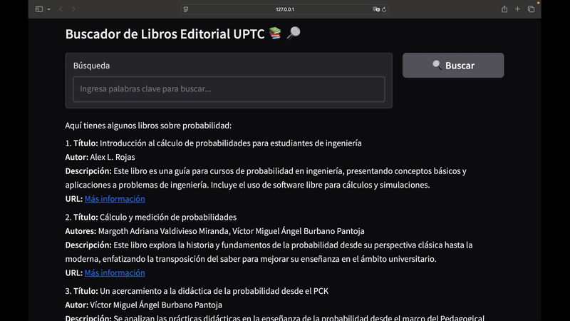

# 📚 Web Scraping y Bases de Datos NoSQL para Libros de la Editorial Uptc 🚀

## 📝 Descripción del proyecto

Este proyecto automatiza la recolección y gestión de información sobre libros de la Editorial Uptc mediante web scraping, almacenando los datos en una base de datos NoSQL (MongoDB). El objetivo es crear un catálogo digital consultable, facilitando la búsqueda y análisis de libros.

Se eligieron Python y MongoDB por su flexibilidad y facilidad de integración, junto con Docker para el despliegue local. El principal reto fue adaptar el scraper a los cambios en la estructura web y limpiar los datos para asegurar su calidad.

A futuro, se planea mejorar el buscador, añadir recomendaciones y desarrollar una interfaz web más amigable.


## 🎬 Demo
----

## ✨ Características principales
- 🔎 Web Scraping automatizado de la Editorial Uptc
- 🗃️ Almacenamiento en MongoDB (NoSQL)
- ⚡ Limpieza y preprocesamiento de datos
- 🧑‍💻 Prototipo de buscador de libros
- 🐳 Uso de Docker para bases de datos locales
- 📈 Preparado para futuras mejoras: recomendaciones e interfaz web


## ⚙️ Instalación

1. **Clona el repositorio:**
   ```bash
   git clone https://github.com/tu-usuario/tu-repo.git
   cd tu-repo
   ```

2. **Crea un entorno virtual (opcional pero recomendado):**
   ```bash
   python3 -m venv venv
   source venv/bin/activate
   ```

3. **Instala las dependencias:**
   ```bash
   pip install -r requirements.txt
   ```

4. **(Opcional) Levanta MongoDB localmente con Docker:**
   ```bash
   docker-compose up -d
   ```

5. **Ejecuta el scraper o el buscador según lo necesites.**

